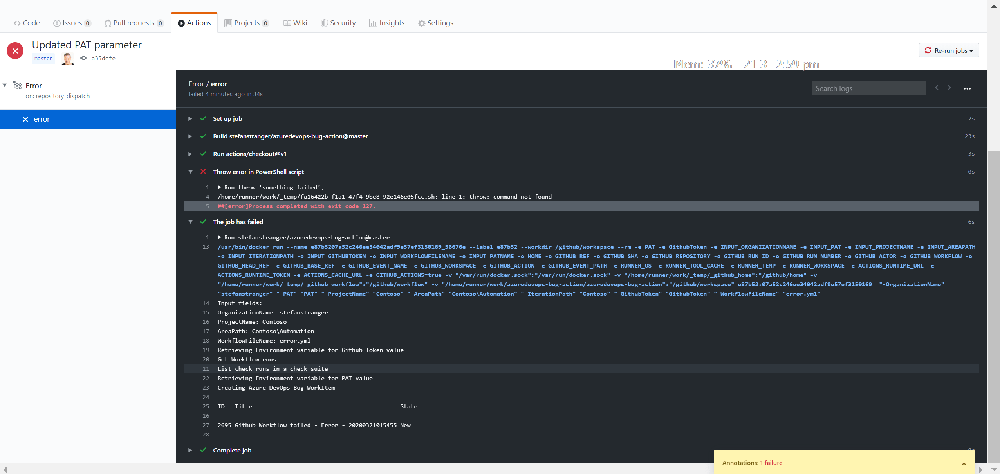
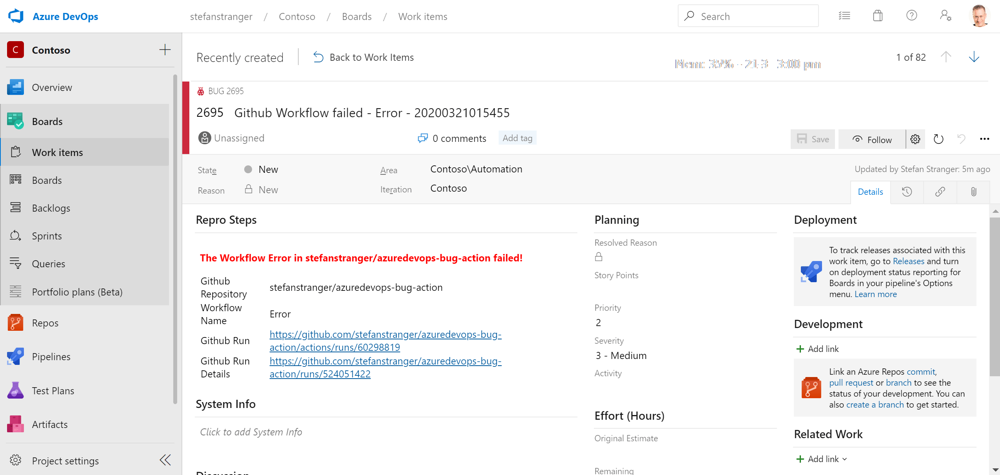
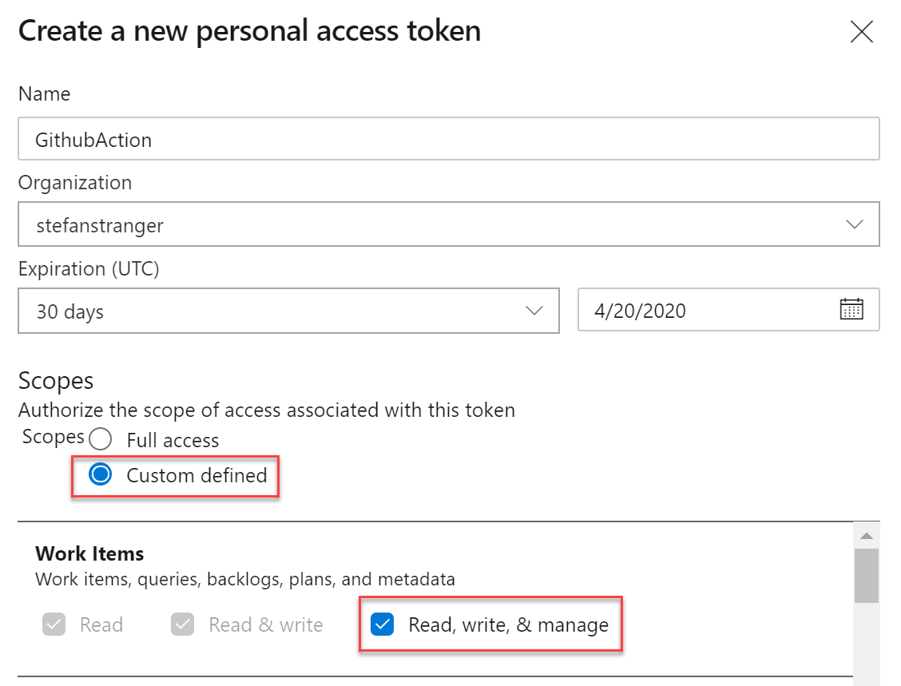
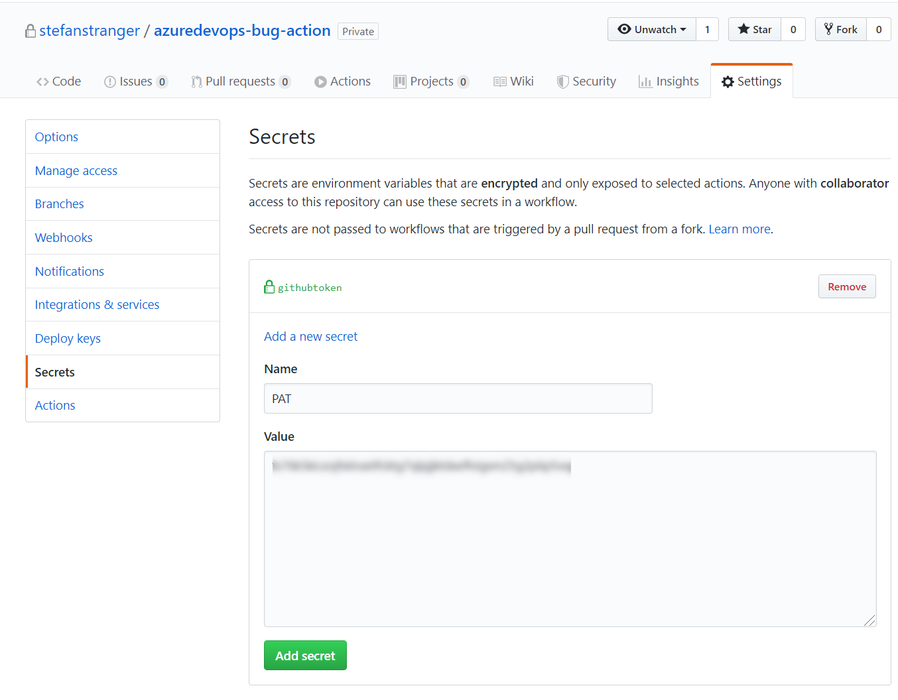
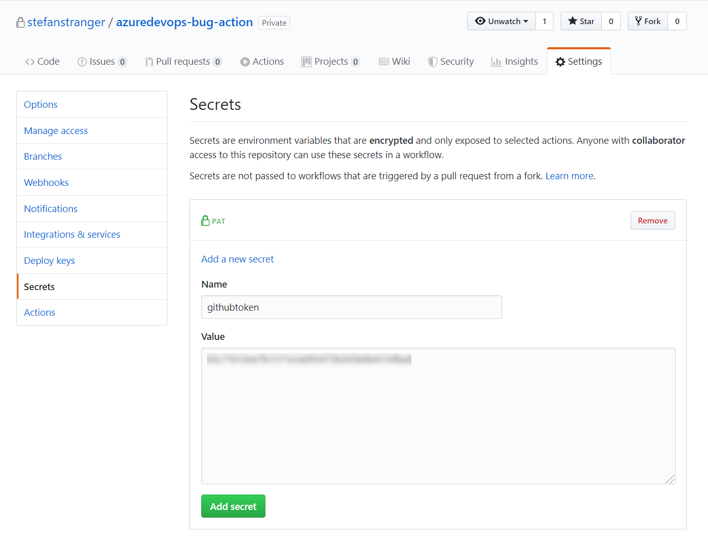

# Github Action to create an Azure DevOps Bug Work Item for failing Github Workflow actions

## Automate your GitHub workflows using Azure Actions

[GitHub Actions](https://help.github.com/en/articles/about-github-actions)  gives you the flexibility to build an automated software development lifecycle workflow.

# Github Action Azure DevOps Bug Work Item

With the Github Action Azure DevOps Bug Work Item you can create an Azure DevOps Bug Work Item for failed Github Workflow Actions.

Screenshot Github Workflow with failed Action



Screenshot Bug created in Azure DevOps Backlog



# Azure DevOps Bug Work Items

As your team identifies code defects or bugs, they can add them to the backlog and track them similar to requirements. Or, they can schedule them to be fixed within a sprint along with other tasks.

More information can be found [here](https://docs.microsoft.com/en-us/azure/devops/organizations/settings/show-bugs-on-backlog?view=azure-devops)

## Sample workflow that uses Azure DevOps Bug Work Item

```yaml
name: Error

on: [push]

jobs:
  error:
    runs-on: ubuntu-latest

    steps:
      - uses: actions/checkout@v1
      - name: Throw error in PowerShell script
        run: |
          throw 'something failed';
      - name: The job has failed
        uses: stefanstranger/azuredevops-bug-action@1.1
        if: failure()
        with:
          OrganizationName: "stefanstranger"
          PAT: "PAT"
          ProjectName: "Contoso"
          AreaPath: "Contoso\\Automation"
          IterationPath: "Contoso"
          GithubToken: "GithubToken"
          WorkflowFileName: "error.yml"
        env:
          PAT: ${{ secrets.PAT}}
          GithubToken: ${{ secrets.githubtoken}}

```

| Input            | Description                                                               |
| ---------------- | ------------------------------------------------------------------------- |
| OrganizationName | Azure DevOps Organization name                                            |
| PAT              | Github Secret Name for PAT stored as Github environment variable          |
| ProjectName      | Azure DevOps Project name                                                 |
| AreaPath         | Azure DevOps Area Path for the Bug Work Items                             |
| IterationPath    | Azure DevOps Iteration Path for the Bug Work Item                         |
| GithubToken      | Github Secret Name for Github Token stored as Github environment variable |
| WorkflowFileName | Github Workflow file name                                                 |

## Configure Personal Access Token (PAT)

For creating the Azure DevOps Bug Work Item we need to create an Azure DevOps Personal Access Token.

More information about creating an Azure DevOps Personal Access token can be found [here](https://docs.microsoft.com/en-us/azure/devops/organizations/accounts/use-personal-access-tokens-to-authenticate?view=azure-devops&tabs=preview-page)

The minimal scope authorization for Work Items is Read, write & manage.



Add the PAT output as [a secret](https://aka.ms/create-secrets-for-GitHub-workflows) (let's say with the name `PAT`) in the GitHub repository.



## Configure Github Token

This Github Action uses the [Github REST API](https://developer.github.com/v3/) to retrieve detailed information about the failed Github Workflow Run.

Create a Github Personal Access Token via the [Github Developer Settings](https://github.com/settings/tokens).

Your Github Token needs the following permissions:

* repo
    * repo:status
    * repo_deployment
    * public_repo
    * repo:invite
* workflow

Add the Github Token [a secret](https://aka.ms/create-secrets-for-GitHub-workflows) (let's say with the name `githubtoken`) in the GitHub repository.



# Change log

* 03-22-2020
    * Initial release of Github Action

* 09-23-2020
    * Updated PowerShell Docker file with latest Alpine PowerShell version (mcr.microsoft.com/powershell:lts-alpine-3.10)
    * Fixed input name of Github Action
    
